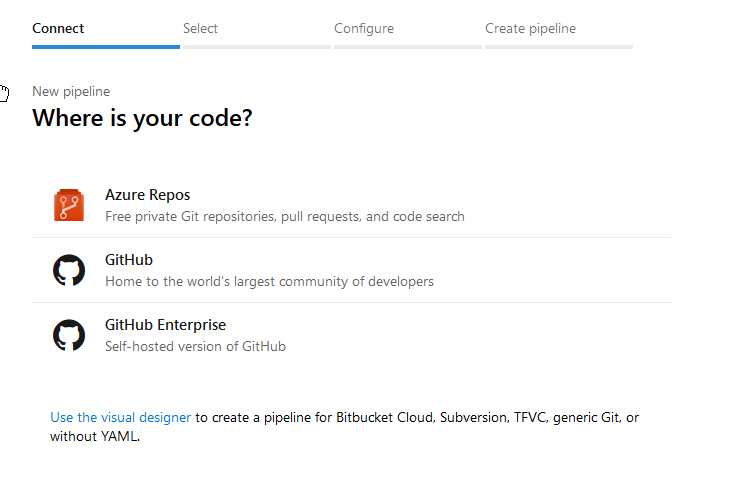
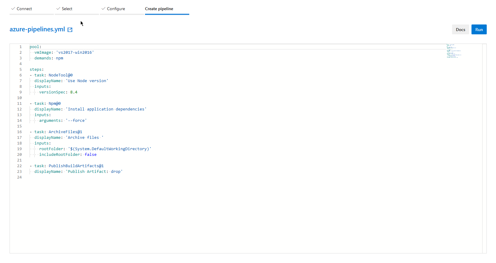

# Deployment to Azure pipelines

This document will cover configuration of CI/CD for a cloud function on Azure, using Azure pipelines.

## Pipeline configuration file

Your cloud function repo should already contain a configuration file - `azure-pipelines.yml` - this must be in place before continuing with the rest of the guide. It should match the following:

```yaml
pool:
  vmImage: 'vs2017-win2016'
  demands: npm

steps:
- task: NodeTool@0
  displayName: 'Use Node version'
  inputs:
    versionSpec: 8.4

- task: Npm@0
  displayName: 'Install application dependencies'
  inputs:
    arguments: '--force'

- task: ArchiveFiles@1
  displayName: 'Archive files '
  inputs:
    rootFolder: '$(System.DefaultWorkingDirectory)'
    includeRootFolder: false

- task: PublishBuildArtifacts@1
  displayName: 'Publish Artifact: drop'
```

After configuring a build pipeline, this file will trigger a build upon commit to any branch. The branches which trigger a build could be limited by adding the following at the top of the file:

```yaml
trigger:
  - azure
  - master
  - development
```

This would trigger a build on commit to any of those three branches - which later, in the release pipeline configuration, could be used to create separate releases to production, stage and development function app instances respectively, by creating three release pipelines - each triggered upon successful build of a specific branch.

## Create an Azure devops project

Firstly, visit the [Azure devops portal](https://dev.azure.com), and register a devops organisation if you haven't already done so. Once the organisation is created, you should be greeted with the following screen:


Create a name for your project, then select **Create project**.

## Build

Now that we have an Azure devops project set up for our pipelines, we must first create and configure the build pipeline - only one of these is required per repository / function, regardless of whether we may want separate releases for different branches.

### Create build pipeline

In the project management interface, select **Pipelines**, **Builds**, then **New pipeline**.


Next, select the source of your cloud functions code. Most likely this will be **GitHub**.



You should then be able to choose the specific repo to fetch from (you will first have to authorize access to your GitHub account).


After selection, if the `azure-pipelines.yml` is already in place in the repo, the configuration process should run automatically and you will end up at this overview of the configuration. Select **Run**.



A build should now run, and you should see the process take place on screen. Confirm that everything succeeds with the build, and address any problems, before continuing with the guide.

## Release

We will now configure the pipeline that takes the results of the build pipeline, and publishes them to an Azure function app.

### Create release pipeline

In the project portal, select **Pipelines**, then **Releases**.


Select **New pipeline**, and you should see the pipeline creation wizard, which will first require template selection.


Search for _functions_, and you should see **Deploy a function app to Azure Functions**, select **Apply**.

### Configure release pipeline

In the pipeline configuration wizard, you will first want to **Add an artifact**, which is where we define the pipeline to take the output of our earlier created build pipeline.

Set the **Source (build pipeline)** to the build pipeline we created earlier. Then, under **Default version**, you most likely want to select **Latest from a specific branch with tags**, and select the branch that you want to use as the source for this release pipeline (otherwise, the release may use the latest build regardless of branch, even if the release is set to only be triggered by a specific branch).


Next, select the trigger icon in the upper right corner of the artifact item, and configure the trigger for the creation of a release under this pipeline.

Set **Continuous deployment trigger** to **Enabled**, and add a build branch filter to **Include** the branch that you want to have trigger the release upon successful build (which itself is triggered by a commit). Most likely, you want this to match the **Default version** branch selected above.


For the final configuration steps, move to the **Tasks** tab, and first select **Stage 1 Deployment process**.

Here you will want to authorize Azure devops to link to your **Azure subscription** (so that the devops portal is able to find your function apps).

Then set **App type** to **Function app**, and select the function app you wish to deploy to under **App service name** (you first need to create the function app resource to deploy to in the [Azure portal](https://portal.azure.com)).


Now, select the **Deploy Azure App Service** task, and scroll down to **Additional Deployment Options**, check **Select deployment method** and choose **Run from package** in the drop-down that appears.


You may then want to edit the pipeline name (simply click the name text at the top of the window), before pressing **Save**.

The release pipeline is now configured. After committing to any branch (or a branch defined in `azure-pipelines.yml`), a build should complete. If the build's source branch matches the trigger branch configured in the release pipeline, a release will then be triggered - which will use the build version from that same branch (provided that the artifact version branch in the release pipeline matches the release trigger branch).